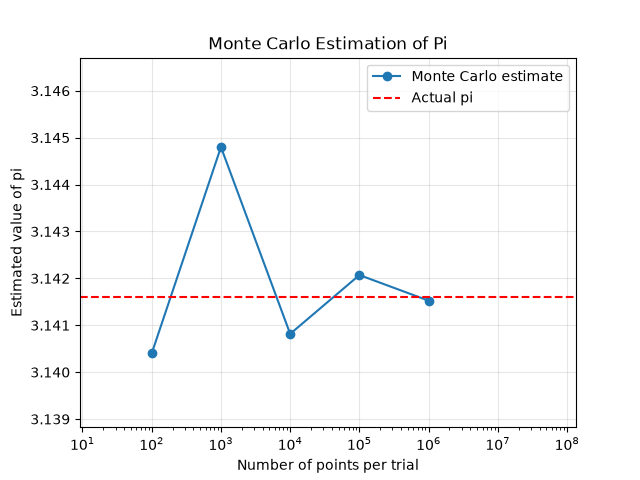
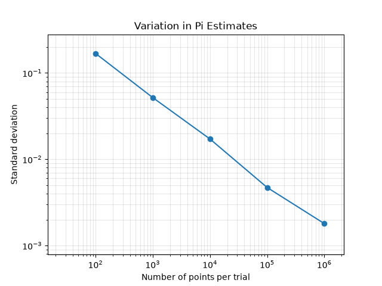
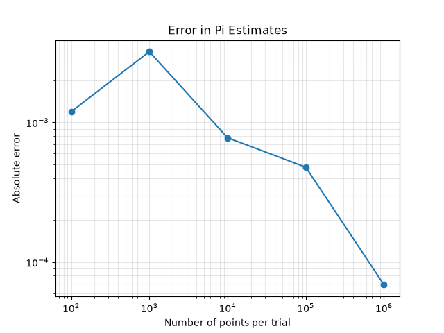

# Monte Carlo Estimation of π

A small computational experiment using Monte Carlo methods to estimate π and study how the statistical variation of the estimate changes with the number of samples.

## Overview

π can be estimated by generating random points in a square of side 1 and checking how many of them fall inside the quarter of a unit circle contained within the square.

The ratio of points inside the quarter circle to the total number of points approaches its area ratio:

\[
\frac{N_{\mathrm{inside}}}{N} \approx \frac{\pi}{4}
\]

which gives

\[
\pi \approx 4\frac{N_{\mathrm{inside}}}{N}
\]

For this experiment, I used 100 independent trials for each of the following sample sizes:

\[
N = 10^2,\ 10^3,\ 10^4,\ 10^5,\ 10^6
\]

For each sample size, the mean and standard deviation of the π estimates were calculated.

## Algorithm

For each value of \(N\):

1. Generate \(N\) random points in a square of side 1.
2. Check whether each point satisfies

   \[
   x^2 + y^2 \leq 1
   \]

3. Use the fraction of points inside the quarter circle to estimate π.
4. Repeat the calculation 100 times.
5. Calculate the mean and standard deviation of the estimates.

I then looked at how the standard deviation changes with \(N\). The expected scaling is

\[
\sigma_\pi \propto N^{-1/2}
\]

so plotting the data on logarithmic axes should give approximately a straight line with a slope close to \(-1/2\).

The scaling exponent was obtained using a linear fit to \(\log(N)\) and \(\log(\sigma_\pi)\).

## Results

The fitted scaling exponent was:

\[
m = -0.5001
\]

This is close to the expected value

\[
m = -\frac{1}{2}
\]

showing the expected \(1/\sqrt{N}\) scaling of the statistical variation.

## Figures

### Monte Carlo estimation of π



### Standard deviation scaling



### Absolute error



## Requirements

Python 3

NumPy

Matplotlib

Install the required packages with:

```bash
pip install -r requirements.txt

